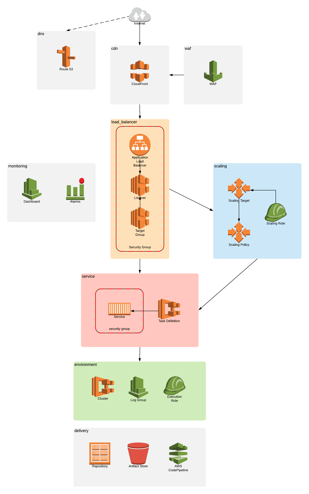

# cni-hello-world

## Structure
- [build](build) - build instructions
- [code](code) - application code
- [delivery](delivery) - delivery infrastructure, all resources involved in the delivery from source control to the live environment
- [deploy](deploy) - deployment instructions
- [infra](infra) - service infrastructure, single environment called `stack`
- [test](test) - simple load test to verify the scaling
- [docs](docs) - documentation support files

## Architecture diagram

## Tools
- tfenv `brew install tfenv`
- terraform `tfenv install 0.11.8`
- alias `tf=terraform`
- nodejs 8.*
- docker 18.*

## Notes
- terraform state could be saved/locked remotely in a team setting
- could pull variables from remote state, like repository
- renamed a module `terraform state mv module.cluster module.environment`
- problem found https://docs.aws.amazon.com/AmazonECS/latest/developerguide/task_cannot_pull_image.html

## Reference
- https://www.terraform.io/docs/providers/aws/index.html

## Next steps
- DNS
- HTTPS
- WAF
- CDN
- Monitoring and Alarms dashboard
- Pipeline
